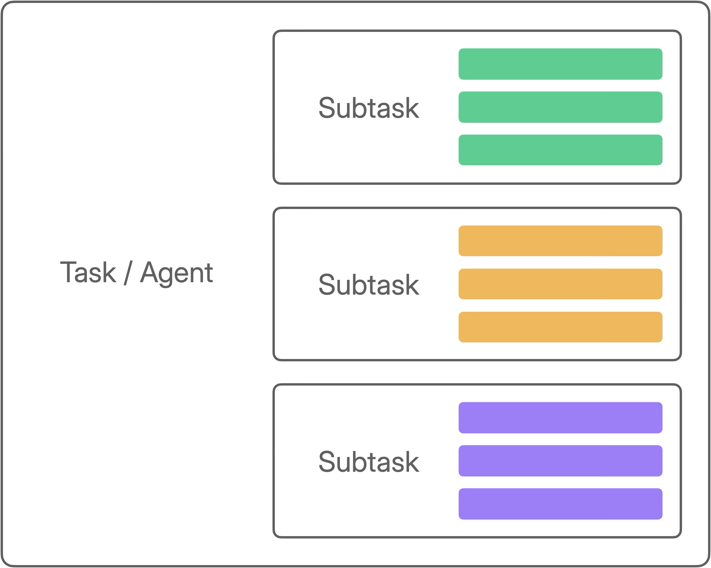
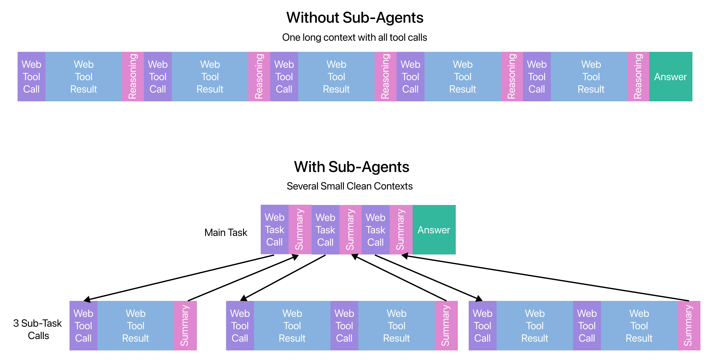

# Agents


You're here early! Multi-actor agents are launching next week


Ah "agents", the most overloaded term in AI! The word "Agents" means different things to different people, but the good news is Kiln supports all the patterns typically associated with "agentic systems". Let's break down the common agent features, and how to build them in Kiln!

* [Tool Use](agents.md#tool-use)
* [Multi-Actor Interaction (aka subtasks)](agents.md#multi-actor-interaction-aka-subtasks)
* [Goal Directed, Autonomous Looping & Reasoning](agents.md#goal-directed-autonomy-and-reasoning)
* [State & Memory](agents.md#state-and-memory)

### Tool Use

Almost every definition of agents includes tool use. This is some way for the agent to interact with the outside world, such as calling a database, calling an API, or even sending an email.

Kiln has full support for adding tools to your Kiln tasks. Tools can be added to Kiln via [MCP servers](tools-and-mcp.md#connecting-tools) or [Kiln Search Tools (RAG)](documents-and-search-rag.md). See the [Tools & MCP](tools-and-mcp.md) docs for details.

### Multi-Actor Interaction (aka subtasks)

Agentic systems often involve an AI agent delegating/coordinating other agents. There are many variants of this pattern with names like orchestrators, supervisors, directors, executors, and experts/assistant.

Kiln has full support for this pattern via Kiln Task as Tools:

#### Kiln Tasks as Tools

In Kiln you can make any Kiln Task into a tool which other tasks can then call. This gives you the flexibility to create multi-actor patterns by organizing a hierarchy of tasks:

<figure><figcaption>
A Kiln task, able to call other Kiln tasks as tools
</figcaption></figure>

To create a Kiln Task as Tool follow these steps:

**Step 1: Create a Kiln Task**

First create a new task. Select "New Task" in the project menu in the sidebar, and fill out the form with a name and prompt.

<figure><figcaption></figcaption></figure>

**Step 2: Add Tools**

If you haven't already and this task requires tools, add tools to your project following the instructions in our [Tools & MCP docs](tools-and-mcp.md).

**Step 2: Create a Run Configuration**

Each Kiln task is run with a "run configuration" which specifies which model is used, which prompt is used, which tools are allowed, and more. Since you want your tool calls to be completely consistent, you must first create and save a run configuration.

The easiest way to create a run configuration is from the "Run" tab in Kiln. You can tweak every parameter, run the task to ensure it works, then save it when you're happy.

<figure><figcaption>
Creating a run configuration in the "Run" tab
</figcaption></figure>

**Step 3: Create a Kiln Task as Tool**

To turn your task and run config into a tool other tasks can call, open "Settings" > "Manage Tools" > "Add Tools" > "Kiln Task as Tool".

When creating you'll be asked to provide a number of options

* Kiln task: which task this tool will call
* Run configuration: which model to use, and which tools to allow this subtask to call
* Tool name: the name of the tool, which the calling task will see
* Tool description: the description of the tool, which the calling task will see


You’ll be asked to provide a tool name and description. These are very important as the model will read them to decide if and when to use this subtask / agent.

For example:

* **Poor:** search - “Search for information” (where will it search?, what information?)
* **Better:** web\_search - “Search the web for information” (does it return webpages? summaries?)
* **Best:** web\_researcher - "This tool can search and scrape the web for information. Ask it a question and it will research using the web, and reply with a summarized answer."


<figure><figcaption>
Creating a Kiln Task as Tool
</figcaption></figure>

**Step 4: Use Your Task as Tool**

To use your new subtask, simply select it from the "Tools & Search" dropdown on the Run tab.

<figure><figcaption>
Adding a Kiln task as tool subtask
</figcaption></figure>

If you always want this task to have access to this tool, use the "Save current options" and "Set as task default" links to create a default run configuration including this task.

**Step 5: Viewing Tool Calls**

When you run a task that has access to subtasks, you're able to view the tool/task invocations in the "All Messages" list. Click the "Messages" link to see the subtasks message list.

<figure><figcaption></figcaption></figure>

#### Context Management

A common issue with agentic systems is that the context window (chat history) gets very long. This can cause several major issues:

* **Filling the context window**: if the context window grows larger than the model supports, it will error and fail
* **Degraded quality**: a large context window can degrade the quality of newly generated content, especially if some of the messages are no longer relevant or inaccurate.
* **Increased costs**: each new message has process all of the tokens in the chat history. Even a short message at the end of a long chain can be expensive. \[note]


**Using subtasks is the easiest way to solve context management issues!**


Let's look at a visual example of an agent which requires many web-searches to build a final answer:

* **Without Sub-Agents**: the context becomes very large very quickly. Entire webpages are loaded into context and stay there. Data we don't need, like web pages that didn't yield useful information, keep taking context room forever. Later calls need to process a large number of tokens to generate the next new token (increasing cost).
* **With Sub-Agents**: each web-research task is performed in its own sub-agent. The results of the webpages are summarized and only the important details are returned to the main task. The context of the main task stays focused and small. Each subtask is also smaller and more focused. Irrelevant data is dropped when the subtask ends. Costs are lower by approximately a factor of&#x20;

<figure><figcaption></figcaption></figure>

### Goal Directed, Autonomy, & Reasoning

Agents typically aim to achieve a specific goal, and are given the ability to run over time to achieve that goal.

* **Goal-directed**: acts to achieve objectives rather than just replying
  * **In Kiln:** you define the agent's goal when you create the task prompt, and when you pass the user input
* **Planning & reasoning:** agents can break problems into steps, decide what to do next, and reason between tool calls
  * **In Kiln:** All tasks plan internally about which tools to call. You can tell your tasks to perform additional reasoning/planning by either 1) selecting a reasoning model, 2) selecting a "Chain of Thought" prompt which will explicitly ask the model to reason during the run loop.
* **Autonomy / Looping**: the agent can choose how to achieve the goal, calling any tool in any order. They can loop, mixing thinking/reasoning and tool calls until their task is complete.
  * **In Kiln:** Every Kiln task can loop, making many tool calls until deciding to return a final result. The task has autonomy to decide which tools to call, in which order.


**Advanced Users: 'ReAct' in Kiln**

A common agent pattern is named 'ReAct'. It was defined in a paper by [Yao et al](https://arxiv.org/abs/2210.03629).

While we don't use the name ReAct in the Kiln app, a Kiln task with a chain-of-thought prompt has the same reasoning+acting steps as described in the ReAct paper.


### State & Memory

Agents maintain state over steps, letting them make progress towards their goals.

Currently Kiln maintains memory simply through the message history. See the [context management](agents.md#context-management) section above for how to use Kiln subtasks to compress memory, summarizing many subtask messages into a shorter summaries in the main-task history.

We're exploring additional memory management options in Kiln. If you have requests, please let us know on the [Discord](https://kiln.tech/discord)!
