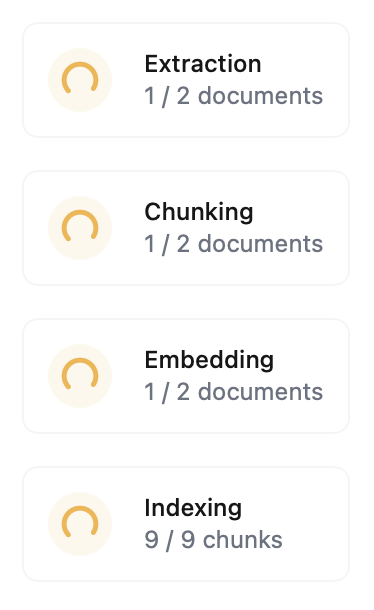

# Documents & Search (RAG)


You're here early. RAG is being launched next week!


RAG (Retrieval-Augmented Generation) is a powerful technique for adding knowledge to AI systems, and Kiln makes building RAG systems incredibly easy!

### Quick Start

Building a search tool in Kiln takes 3 steps:

1. [Adding Documents](documents-and-search-rag.md#adding-documents): Drag and drop files into the Kiln document library
2. [Create a search tool](documents-and-search-rag.md#building-a-search-tool): specify how you want Kiln to search the documents
3. [Use the tool](documents-and-search-rag.md#using-search-tools): Select the search tool when running your task

### Document Library

You can open the document library from the “Manage Documents” link in the “Docs & Search” tab.

#### Adding Documents

To add documents, simply click “Add Documents” in the Document Library, then drag-and-drop in as many files as you like.

<figure><figcaption>
The Add Documents dialog
</figcaption></figure>


Documents are added to your Kiln project; if you’re using Kiln to [collaborate with a team](collaboration.md), documents will be available to everyone.


#### Supported File Types

Kiln supports the following file types:

* **Documents**: .pdf, .txt, .md, .html
* **Images**: .jpg, .jpeg, .png
* **Videos**: .mp4, .mov
* **Audio**: .mp3, .wav, .ogg


Not every extraction model can handle every file type. Use Google Gemini models for maximal filetype support. When creating a custom search tool, the model selection dropdown will list supported file types.


#### Tagging Documents

Documents can be organized by adding tags. This is typically used to sub-divide your docs library into sections, which allows you to build search tools targeting specific document sets. Here are some examples:

* **knowledge\_base**: your public help docs / knowledge base
* **customer\_support\_policies**: internal docs for how to respond to various types of customer requests
* **product\_specs**: feature definitions, product requirement docs, spec sheets
* **blog\_posts**: your company’s blog posts

You can add or remove tags in Kiln in 2 ways:

1. Single document: open a document’s page in the document library, then add or remove tags using the “Tags” sidebar.
2. Many documents: click “select” in the document library, select all relevant documents, click the tag icon, then select “Add Tags” or “Remove Tags”

<figure><figcaption>
Managing tags from the document's detail page
</figcaption></figure>

### Building a Search Tool

Once you’ve added documents, you can create a search tool in a few clicks!

#### Suggested Search Configurations

If you're new to building RAG systems, we strongly recommend selecting one of the suggested search configurations to start. These are high quality RAG setups that can give you state of the art performance. Simply select one of the following templates from "Docs & Search" > "Manage Search Tools" > "Add Search Tool":

* **Best Quality**: The best quality search configuration we’ve found. Uses Gemini 2.5 Pro to extract documents to text.
* **Cost Optimized**: Still excellent, but lower cost. This configuration uses Gemini 2.5 Flash to extract documents to text.
* **Vector Only**: A configuration which only uses vector search for semantic similarity, without keyword search. Useful when you want to search only on semantic meaning without weighing the keywords in the query.
* **OpenAI Based**: We suggest using a Gemini-powered config above if possible — they support more document types and have better document extraction quality. However, if you are required to use OpenAI APIs, try this configuration with GPT-4o. This config does not support transcribing audio and video.

We’re working on adding more document extractors and embedding providers to expand this list.

#### Search Tool Name & Description

When you’re creating a search tool, you’ll be asked to provide a tool name and description. These are important as the model will read them to decide if and when to use your search tool.

For example:

* **Poor:** search\_tool - “Search documents for knowledge”
* **Better:** doc\_search - “Search the knowledge base for product information”
* **Best:** knowledge\_base\_search - "Search Kiln's user-facing documents, guides, and walkthroughs."

In the first example, the model will have no idea what type of documents it has access to, or if/when to search them. The last example is much better; from it the model knows what the documents are, the audience they are written for, and can infer when searching them would be helpful to a task.

#### Custom Search Configurations

If you have experience with RAG systems, you can create a completely custom RAG. Simply select “Create Custom” on the “Add Search Tool (RAG)” screen.


**Advanced Users Only**: unless you have experience with AI embeddings and search, we suggest sticking to the suggested search tool configurations.


You can customize:

* Extractor: The model used to extract non-text documents (e.g. PDFs, videos) into text. Optionally customize the prompts passed to the extractor model for each type of file.
* Chunking Strategy: specify how large documents are split into smaller chunks for embedding, indexing, and retrieval
* Embeddings: specify the embedding model and embedding dimensions
* Search Index / Vector Store: select the search index strategy including vector index, full-text/keyword search (BM25), or hybrid mode.

Want to see more options here? Let us know on our [Discord](https://kiln.tech/discord)!

#### Processing Documents

After adding documents, Kiln must process them before they can be searched. You can monitor progress on the "Search Tools (RAG)" page. See [how it works](documents-and-search-rag.md#how-it-works) below for more information about what each step is doing.

<figure><figcaption>
Waiting on Processing
</figcaption></figure>

### Using Search Tools

Once you’ve [created a search tool](documents-and-search-rag.md#building-a-search-tool) and [processing is complete](documents-and-search-rag.md#processing-documents), you can run your search tools!

#### Using a Search Tool in a Task

To use a search tool in a task, simply select it from the “Tools” dropdown in the “Advanced” section of the Run page then run your task.

<figure><figcaption>
Selecting a search tool in "Run"
</figcaption></figure>

The search tool will be provided to your task, and your model may invoke it. You can view the model’s tool calls and the search tool’s response in the “All Messages” section of the run page:

<figure><figcaption>
A trace including a tool call to a search tool
</figcaption></figure>


It’s the model’s choice if and when to invoke a tool. If the model isn’t invoking search when you feel it should, consider updating your [tool name/description](documents-and-search-rag.md#search-tool-name-and-description) to be more descriptive of when it should be used, or update your task prompt to instruct it to call the tool.


#### Testing Your Search Tool

If you just want to test your tool to see what it returns, you can do so from "Docs & Search" > "Search Tools" > search tool details. Enter any query to see what your search tool returns.

This mode is intended only for testing. It will render the raw chunks as would be returned to the AI task. You wouldn't normally expose these results directly to a user, and instead would have an AI task extract answers or summarize the content.

<figure><figcaption>
A search tool test invocation
</figcaption></figure>

### How it Works

Under the hood, there are 4 stages to Kiln's RAG/search pipeline:

1. Document Extraction: convert documents like PDFs, videos, and audio into text data that language models can read.
2. Chunking: break down large documents into smaller chunks
3. Embedding: generate semantic embeddings from your chunks
4. Search: index the embeddings and chunks in a vector database, then search it
