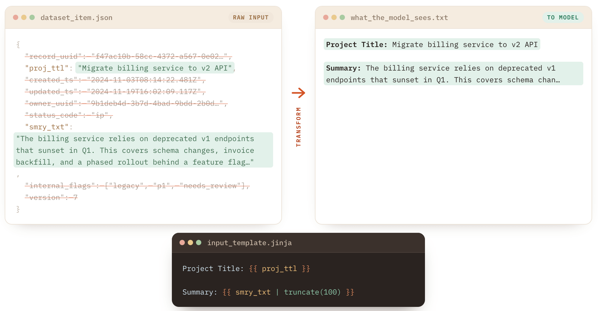

# Input Templates & Feature Engineering


Input templates are in beta, and will be in our next release


## Input Templates & Feature Engineering

Feature engineering is the process of controlling which data (features) you expose to a model. When you expose only what's needed — without irrelevant data or duplication — models often perform better. With LLMs, even the order and formatting of your data matters.

### Input Templates

Kiln makes it easy to experiment with feature engineering using input templates. They let you transform your raw input data into a new, cleaner format before it's sent to the model.

<figure><figcaption></figcaption></figure>

#### Jinja Templates

Kiln lets you write [Jinja2 templates](https://github.com/pallets/jinja) to transform your input into other formats. Jinja has a range of powerful tools like filters, loops, conditionals, field access, and JSON helpers. AI agents like Claude Code and ChatGPT are excellent at writing these templates if you're new to Jinja.

For example, a template that pulls just two fields out of a larger structured input:

```jinja
Project Title: {{ input.title }}

Summary: {{ input.summary }}
```

To create an input transformer, go to the **Run** tab in Kiln, expand **Advanced**, and select **Add** under **Input Transformer**. You'll be prompted for a Jinja template. You can then run your task as usual.

You can optionally save this run config (including your template) for use in evals, which will give you metrics on how much it helps (or hurts) task performance.

#### Template Inputs

Templates have access to exactly one variable: `input`, which holds your entire task input. Insert the whole thing with `{{ input }}`, or reach into it with attribute and index syntax. The same `input` reference works for every task type — there's no special unpacking to learn.

What `input` contains depends on your task's input type:

| Task input type     | `input` is… | Example template                                     |
| ------------------- | ----------- | ---------------------------------------------------- |
| Structured (schema) | The object  | `{{ input.question }} — {{ input.context }}`         |
| List / array        | The list    | `{{ input[0] }}`, `{{ input \| length }}`, or a loop |
| Plain text          | The string  | `{{ input }}`                                        |

If your task takes plain text and that text happens to be valid JSON, Kiln parses it automatically so you can use field access — an input of `{"name": "Alice"}` lets you write `{{ input.name }}`. If the text isn't valid JSON, `{{ input }}` echoes it verbatim.

**Technical notes**

* Input templates are stored as part of a run configuration. Your dataset doesn't need to change at all — all past dataset items remain valid, while still transforming what the LLM sees. Your callers still pass the exact same data as before, and your original input is always preserved on the run record; only the message the model sees is transformed.
* Built-in Jinja2 filters are available (`length`, `join`, `default`, `tojson`, `upper`, etc.), but custom filters are not. Execution is sandboxed — no inline Python code.

### Feature Engineering Techniques

Here's a (very) brief introduction to the basics of feature engineering.

#### Filtering

Filtering out unnecessary data is a great way to improve AI performance. Look for things you can filter:

* ID fields that have no meaning to the model (UUIDs, internal keys)
* Unnecessary formatting
* Irrelevant fields or data the model doesn't need for the task at hand

#### Formatting

* Convert from token-heavy formats like JSON down to just the data you need (see the example above).
* Convert XML/JSON data into data with better variable names (`ref_res` → `refund_reason`).
* Convert internal enums/codes into data the model can understand (`cccb` → `credit_card_chargeback`).
*   Limit the length of plaintext fields to prevent unbounded input size. For example, truncate a description to 300 characters:

    ```jinja
    Description: {{ input.description[:300] }}
    ```
* Control the order information is presented. High-level → detailed is typically best, but API data can also be key-sorted or left unsorted.
* We've even seen performance improve by pretty-printing JSON!


The best way to know whether a transformation helps is to measure it. Save your run config and compare it against the original using [Kiln Evals](evals-and-specs/).

