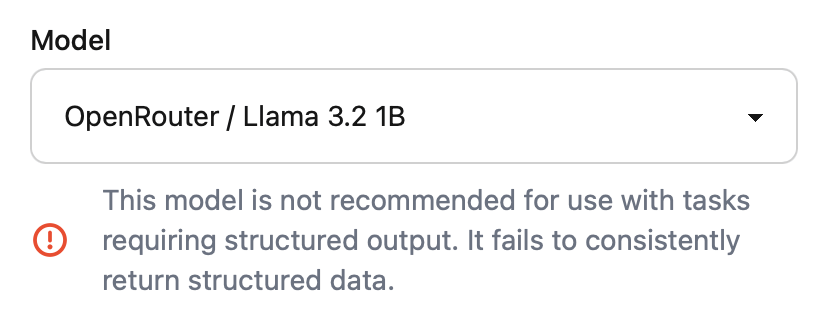
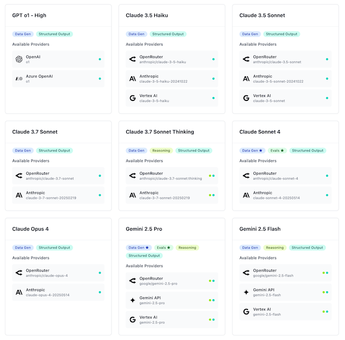

# Models and AI Providers

<figure><figcaption></figcaption></figure>

## Skip the Guesswork: Kiln Suggests Models

Picking a model for a specific task can be hard. Each has different capabilities such as supported JSON modes, reasoning support, API features (logprobs, temperature) and censorship levels. Some work great for synthetic data and evals, others no so much.

We have written over 2000 test cases testing each popular model, on each AI provider, for each important feature. The tests are updated weekly, and we publish these capabilities in our model library. With this knowledge, the Kiln app automatically suggests appropriate models and model settings for each task. It will even warn you if you select a model that's unlikely to work. Read more on our blog: [I wrote 2000 LLM test cases so you don't have to](https://kiln.tech/blog/i_wrote_2000_llm_test_cases_so_you_dont_have_to).

<figure><figcaption>
Kiln's model selector is task aware
</figcaption></figure>

## Connecting AI Providers

When you first run Kiln, the app will prompt you to setup one or more AI providers. You need at least one for the core features of Kiln to function.

We currently support the following AI providers:

* Ollama
* OpenRouter
* OpenAI
* Groq
* Fireworks.ai
* Cerbras
* Together.ai
* AWS Bedrock
* Anthropic
* Gemini AI Studio / Gemini API
* Google Vertex AI
* Azure OpenAI
* HuggingFace
* SiliconFlow.cn (for users in China)
* Any OpenAI compatible API like LiteLLM, vLLM, LMStudio, llama.cpp server, and many more

If you want to add or remove providers after initial setup, open `Settings > AI Providers & Models`.


Don't see your provider listed? Most providers offer an OpenAI compatible API that Kiln can connect to. This includes common open source projects like LiteLLM and vLLM. Search their docs, and connect via the "Custom API" option in Kiln.


## Understanding and Adding Models

Models come in several flavours, from very easy to use, to advanced methods for expert users:

* [Included Models - Recommended](models-and-ai-providers.md#included-models-recommended)
* [Custom Ollama models](models-and-ai-providers.md#custom-ollama-models)
* [Custom models from existing providers](models-and-ai-providers.md#custom-models-from-existing-providers)
* Provider Specific Guidance
  * [Azure OpenAI API](models-and-ai-providers.md#azure-openai-api)
  * [Azure AI Foundry / Azure AI Studio](models-and-ai-providers.md#azure-ai-foundry-formerly-azure-ai-studio-microsoft-ai-for-enterprise-360-elite)
* [Custom OpenAI compatible servers](models-and-ai-providers.md#custom-openai-compatible-servers)
  * [LiteLLM](models-and-ai-providers.md#litellm) - Anthropic, Huggingface, VertexAI, TogetherAI, and more.

### Included Models from the Model Library - Recommended

Included models are models that have been tested to work with Kiln's various features. These are the easiest to use, and generally won't result in errors.

To use these models simply connect any AI provider from the Settings page. Once connected, you can select these model from the model dropdown on the Run screen. The dropdown will warn if you attempt to use a model that doesn't support a feature (like structured output or synthetic data generation).

View all available models in our [model library on our webpage](https://kiln.tech/model_library) or the models tab in app. We update this list as new models come out.

<figure><figcaption>
The Kiln Model Library
</figcaption></figure>

You can request we add models on our [Discord](https://kiln.tech/discord).

### Fine-Tuneable Models

The [model library](https://kiln.tech/model_library) or the models tab in app lists many of the of models that Kiln can fine-tune. Kiln can fine-tune even more models than shown in our library, including:

* Additional Fireworks.ai models: as soon as you connect a Fireworks.ai API key, over 60 additional models will be available for tuning in the Kiln UI. These are loaded live from Fireworks, and update automatically as new models are released. See a preview list below.
* Tune almost any model via tools like Unsloth: see our [fine-tuning guide](fine-tuning/fine-tuning-guide.md) for instructions on how to export fine-tuning datasets from Kiln for use with any tuning tool.

60+ Fine-Tuneable Models on Fireworks.ai

New models will automatically appear in Kiln as they are released by Fireworks. Here's a snapshot:

* Chronos Hermes 13B v2 (chronos-hermes-13b-v2)
* Code Llama 13B (code-llama-13b)
* Code Llama 13B Instruct (code-llama-13b-instruct)
* Code Llama 13B Python (code-llama-13b-python)
* Code Llama 34B (code-llama-34b)
* Code Llama 34B Instruct (code-llama-34b-instruct)
* Code Llama 34B Python (code-llama-34b-python)
* Code Llama 70B (code-llama-70b)
* Code Llama 70B Instruct (code-llama-70b-instruct)
* Code Llama 70B Python (code-llama-70b-python)
* Code Llama 7B (code-llama-7b)
* Code Llama 7B Instruct (code-llama-7b-instruct)
* Code Llama 7B Python (code-llama-7b-python)
* CodeQwen 1.5 7B (code-qwen-1p5-7b)
* Cogito v1 Preview Llama 3B (cogito-v1-preview-llama-3b)
* Cogito v1 Preview Llama 70B (cogito-v1-preview-llama-70b)
* Cogito v1 Preview Llama 8B (cogito-v1-preview-llama-8b)
* Cogito v1 Preview Qwen 14B (cogito-v1-preview-qwen-14b)
* Cogito v1 Preview Qwen 32B (cogito-v1-preview-qwen-32b)
* DeepSeek Coder 1.3B Base (deepseek-coder-1b-base)
* DeepSeek Coder 33B Instruct (deepseek-coder-33b-instruct)
* DeepSeek Coder 7B Base (deepseek-coder-7b-base)
* DeepSeek Coder 7B Base v1.5 (deepseek-coder-7b-base-v1p5)
* DeepSeek Coder 7B Instruct v1.5 (deepseek-coder-7b-instruct-v1p5)
* DeepSeek Coder V2 Instruct (deepseek-coder-v2-instruct)
* DeepSeek Coder V2 Lite Base (deepseek-coder-v2-lite-base)
* DeepSeek Coder V2 Lite Instruct (deepseek-coder-v2-lite-instruct)
* DeepSeek Prover V2 (deepseek-prover-v2)
* DeepSeek R1 (Fast) (deepseek-r1)
* Deepseek R1 05/28 (deepseek-r1-0528)
* DeepSeek R1 0528 Distill Qwen3 8B (deepseek-r1-0528-distill-qwen3-8b)
* DeepSeek R1 (Basic) (deepseek-r1-basic)
* DeepSeek R1 Distill Llama 70B (deepseek-r1-distill-llama-70b)
* DeepSeek R1 Distill Llama 8B (deepseek-r1-distill-llama-8b)
* DeepSeek R1 Distill Qwen 14B (deepseek-r1-distill-qwen-14b)
* DeepSeek R1 Distill Qwen 1.5B (deepseek-r1-distill-qwen-1p5b)
* DeepSeek R1 Distill Qwen 32B (deepseek-r1-distill-qwen-32b)
* DeepSeek R1 Distill Qwen 7B (deepseek-r1-distill-qwen-7b)
* DeepSeek V2 Lite Chat (deepseek-v2-lite-chat)
* DeepSeek V2.5 (deepseek-v2p5)
* DeepSeek V3 (deepseek-v3)
* Deepseek V3 03-24 (deepseek-v3-0324)
* Dolphin 2.9.2 Qwen2 72B (dolphin-2-9-2-qwen2-72b)
* FireFunction V2 (firefunction-v2)
* Llama 4 Maverick Instruct (Basic) (llama4-maverick-instruct-basic)
* Llama 4 Scout Instruct (Basic) (llama4-scout-instruct-basic)
* Llama Guard v2 8B (llama-guard-2-8b)
* Llama Guard v3 1B (llama-guard-3-1b)
* Llama Guard 3 8B (llama-guard-3-8b)
* Llama Guard 7B (llamaguard-7b)
* Llama 2 13B (llama-v2-13b)
* Llama 2 13B Chat (llama-v2-13b-chat)
* Llama 2 70B (llama-v2-70b)
* Llama 2 70B Chat (llama-v2-70b-chat)
* Llama 2 7B (llama-v2-7b)
* Llama 2 7B Chat (llama-v2-7b-chat)
* Llama 3 70B Instruct (llama-v3-70b-instruct)
* Llama 3 70B Instruct (HF version) (llama-v3-70b-instruct-hf)
* Llama 3 8B (llama-v3-8b)
* Llama 3 8B Instruct (llama-v3-8b-instruct)
* Llama 3 8B Instruct (HF version) (llama-v3-8b-instruct-hf)
* Llama 3.1 70B Instruct (llama-v3p1-70b-instruct)
* Llama 3.1 8B Instruct (llama-v3p1-8b-instruct)
* Llama 3.1 Nemotron 70B (llama-v3p1-nemotron-70b-instruct)
* Llama 3.2 1B (llama-v3p2-1b)
* Llama 3.2 1B Instruct (llama-v3p2-1b-instruct)
* Llama 3.2 3B (llama-v3p2-3b)
* Llama 3.2 3B Instruct (llama-v3p2-3b-instruct)
* Llama 3.3 70B Instruct (llama-v3p3-70b-instruct)
* MythoMax L2 13B (mythomax-l2-13b)
* Nous Hermes 2 Yi 34B (nous-hermes-2-yi-34b)
* Nous Hermes Llama2 13B (nous-hermes-llama2-13b)
* Nous Hermes Llama2 70B (nous-hermes-llama2-70b)
* Nous Hermes Llama2 7B (nous-hermes-llama2-7b)
* Phind CodeLlama 34B Python v1 (phind-code-llama-34b-python-v1)
* Phind CodeLlama 34B v1 (phind-code-llama-34b-v1)
* Phind CodeLlama 34B v2 (phind-code-llama-34b-v2)
* Qwen1.5 72B Chat (qwen1p5-72b-chat)
* Qwen2 72B Instruct (qwen2-72b-instruct)
* Qwen2 7B Instruct (qwen2-7b-instruct)
* Qwen2.5 0.5B Instruct (qwen2p5-0p5b-instruct)
* Qwen2.5 14B (qwen2p5-14b)
* Qwen2.5 14B Instruct (qwen2p5-14b-instruct)
* Qwen2.5 1.5B Instruct (qwen2p5-1p5b-instruct)
* Qwen2.5 32B (qwen2p5-32b)
* Qwen2.5 32B Instruct (qwen2p5-32b-instruct)
* Qwen2.5 72B (qwen2p5-72b)
* Qwen2.5 72B Instruct (qwen2p5-72b-instruct)
* Qwen2.5 7B (qwen2p5-7b)
* Qwen2.5 7B Instruct (qwen2p5-7b-instruct)
* Qwen2.5-Coder 0.5B (qwen2p5-coder-0p5b)
* Qwen2.5-Coder 0.5B Instruct (qwen2p5-coder-0p5b-instruct)
* Qwen2.5-Coder 14B (qwen2p5-coder-14b)
* Qwen2.5-Coder 14B Instruct (qwen2p5-coder-14b-instruct)
* Qwen2.5-Coder 1.5B (qwen2p5-coder-1p5b)
* Qwen2.5-Coder 1.5B Instruct (qwen2p5-coder-1p5b-instruct)
* Qwen2.5-Coder 32B (qwen2p5-coder-32b)
* Qwen2.5-Coder 32B Instruct (qwen2p5-coder-32b-instruct)
* Qwen2.5-Coder 32B Instruct 128K (qwen2p5-coder-32b-instruct-128k)
* Qwen2.5-Coder 32B Instruct 32K RoPE (qwen2p5-coder-32b-instruct-32k-rope)
* Qwen2.5-Coder 32B Instruct 64k (qwen2p5-coder-32b-instruct-64k)
* Qwen2.5-Coder 3B (qwen2p5-coder-3b)
* Qwen2.5-Coder 3B Instruct (qwen2p5-coder-3b-instruct)
* Qwen2.5-Coder 7B (qwen2p5-coder-7b)
* Qwen2.5-Coder 7B Instruct (qwen2p5-coder-7b-instruct)
* Qwen2.5-Math 72B Instruct (qwen2p5-math-72b-instruct)
* Qwen2.5-VL 32B Instruct (qwen2p5-vl-32b-instruct)
* Qwen2.5-VL 3B Instruct (qwen2p5-vl-3b-instruct)
* Qwen2.5-VL 72B Instruct (qwen2p5-vl-72b-instruct)
* Qwen2.5-VL 7B Instruct (qwen2p5-vl-7b-instruct)
* Qwen3 0.6B (qwen3-0p6b)
* Qwen3 1.7B (qwen3-1p7b)
* Qwen3 32B (qwen3-32b)
* Qwen3 4B (qwen3-4b)
* Qwen3 8B (qwen3-8b)
* Qwen QWQ 32B Preview (qwen-qwq-32b-preview)
* Qwen2.5 14B Instruct (qwen-v2p5-14b-instruct)
* Qwen2.5 7B (qwen-v2p5-7b)
* QWQ 32B (qwq-32b)
* Rolm OCR (rolm-ocr)
* Yi 34B (yi-34b)
* Nouse Capybara 34B V1.9 (yi-34b-200k-capybara)
* Yi 34B Chat (yi-34b-chat)

### Custom Ollama Models

Any Ollama model you have installed on your server will be available to use in Kiln. To add models, simply install them with the Ollama CLI `ollama pull <model_name>`.

Some Ollama models are included/tested, and will automatically appear in the model dropdown. Any untested Ollama models will still appear in the dropdown, but in the "Untested" section.

### Custom Models from Existing Providers

If you want to use a model that is not in the list but is supported by one of our AI providers, you can use a custom model.

To use a custom model, click "Add Model" in the "AI Providers & Models" section of Settings.

These will appear in the "untested" section of the model dropdown.

### Provider Specific Guidance

#### Azure OpenAI API

When using Azure OpenAI API, you need to deploy each model you want to use, manually through the Azure console. If you have not, you'll get deployment errors when trying to call a model.

* **Suggested - Deploy with Default Names**: If you deploy with the default names, for example "gpt-4o"/"gpt-4o-mini", you can simply use the models using the dropdown in Kiln.
* **Deployments with Custom Names**: If you have a non-standard deployment name, you'll have to add each model as a [custom model](models-and-ai-providers.md#custom-models-from-existing-providers), using the deployment name as the model name.

#### Azure AI Foundry (formerly Azure AI Studio, Microsoft AI for Enterprise 360 Elite)

When using Azure AI Foundry, you need to deploy each model you want to use manually through the Azure console. If you have not, you'll get deployment errors when trying to call a model.

After deploying a model, you must add it to Kiln as a [custom model](models-and-ai-providers.md#custom-models-from-existing-providers), using the deployment name as the model name.

#### Google Vertex AI

When using Vertex, many models need to be manually enabled through the console before using them (primarily Anthropic models). If you see errors when trying to run a model, open the vertex AI console for your project, go to the model garden, and enable that model.

Similarly, if you see quota errors you may need to manage/request quota from the Vertex console. Quota is specific to the model + region. Ensure you request quota in the region you specified when you connected Vertex AI to Kiln.

#### Hugging Face

Hugging face has thousands of models. We've included a few of these common models in the Kiln built-in model list, but you can add any hugging face model via the [custom model](models-and-ai-providers.md#custom-models-from-existing-providers) option.

Hugging face errors are not always descriptive - if you get 400 errors, it's likely the model you've selected requires a Hugging Face Pro subscription. Try the same model in their UI for a more helpful error message.

### Custom OpenAI Compatible Servers

If you have an OpenAI compatible server (LiteLLM, vLLM, etc.), you can use it in Kiln.

To do this, add a "Custom API" in the "AI Providers & Models" section of Settings.

All models supported by this API will appear in the "untested" section of the model dropdown.

Notes:

* The API must support the `/v1/models` endpoint, so Kiln can access the list of models.
* Many Kiln tasks produce structured (JSON) output. These can be hard to get working on custom servers, as each server/model pair usually needs some configuration to reliably produce structured output (tools vs json\_mode vs json parsing vs json\_schema, etc).
