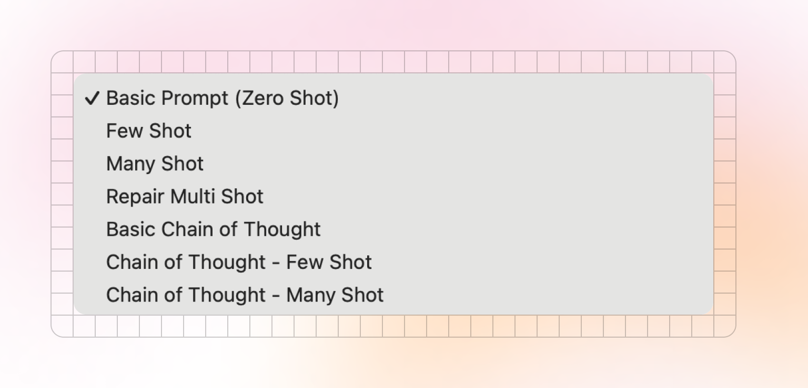

# Prompts

There are two style of prompts in Kiln:

* [Prompt Generators](prompts.md#prompt-generators): Kiln can automatically generate many popular prompt styles from your task and dataset (few-shot, many-shot, chain of thought, chain of thought multi-shot, and more). The more you use your task, and rate the results, the richer your prompts become.
* [Custom Prompts](prompts.md#custom-prompts): create, save and share any custom prompts

<figure><figcaption></figcaption></figure>

## Prompt Generators

### Prompt Generator Inputs

When you create a Kiln task you specify several fields which are used when generating prompts:

* Instructions: The core of your prompt. Describe the task as you would in a standard LLM prompt.
* Requirements: A list of requirements you want the LLM to adhere to (e.g. "Use professional tone"). These are used in 2 places: 1) they are included in the prompt text sent to the LLM, and 2) they available as rating criteria on any run response.
* Thinking Instructions: This field allows you to specify a portion of the prompt, which is only used when you select a "chain of thought" prompt template. If omitted, the default is "Think step by step, explaining your reasoning.".&#x20;

These can be edited in  `Settings > Edit Task > Task Instructions` .

### Adding Content for Multi-Shot Prompts

Multi-shot prompting is when you provide several examples in the prompt, and has been shown to greatly improve output quality.

In order to use multi-shot prompting in Kiln, we need some correct example content to use. Kiln makes this easy! Simply run your task in the Run tab of the UI, and rate the output. As you collect more 4 and 5 star responses, the set of available content for multi-shot prompting increases.

Kiln will automatically select content for multi-shot prompts using your dataset, using the following priority:

* 5-star [repairs](repairing-responses.md): where a human has given feedback, repaired the response, and rated the repair 5-stars
* 5-star responses
* 4-star response

Responses with a 3-star or worse rating are never used, unless they have been [repaired](repairing-responses.md) to 5-stars.

### Prompt Generators

Once you've setup your task and added some example content, you'll have a number of prompt generators to choose from:

* **Basic (Zero Shot)**: a prompt template that will only use your task definition (instructions and requirements). This prompt is deterministic, and won't change unless you edit your task.
* **Few Shot**: a mult-shot prompt that will include the 4 best examples from your dataset, on top of the basic prompt.
* **Many Shot**: a mult-shot prompt that will include the 25 best examples from your dataset, on top of the basic prompt.
* **Repair Multi Shot**:  a mult-shot prompt that will include the 25 best examples from your dataset, on top of the basic prompt. This [prompt will use repaired examples](repairing-responses.md) to show 1) the generated content which had issues, 2) the human feedback about what was incorrect, 3) the corrected 5-star content. This gives the LLM examples of common errors to avoid.
* **Basic Chain of Though**: a [chain of thought](reasoning-and-chain-of-thought.md) prompt template that will only use your task definition (instructions, requirements, and thinking instructions). Kiln will return the response in 2 stages, 1) thinking stage, 2) response stage. Both are stored in the dataset, but typically only stage 2 is used in the app/product. For structured tasks, the final answer must conform to the schema, but the thinking stage is plain test. This prompt is deterministic, and won't change unless you edit your task.
* **Chain of Thought - Few Shot**: a prompt that applies both the few shot template (4 examples), and chain-of-thought thinking instructions.
* **Chain of Thought - Many Shot**: a prompt that applies both the many shot template (25 examples), and chain-of-thought thinking instructions.

## Custom Prompts / Saved Prompts

You can also create and share custom prompts inside Kiln. Simply open the "Prompts" tab on the left of the UI. Anyone you [collaborate](collaboration.md) with will have access to these prompts as well.

Custom prompts include several fields:

* Name: a name for you and your team to idenify this prompt. Not used by the model.
* Prompt (aka System Message): The core of your prompt. Will be passed to the model as a system message before any user data is sent.
* Chain of thought instructions: if provided, using this prompt will add an extra "thinking"/reasoning phase it's it's execution. These instructions guide how the model should "think" about the problem before answering. See [COT docs](reasoning-and-chain-of-thought.md#chain-of-thought-call-flow-non-reasoning-model) for details.&#x20;

## Viewing Prompts

The "Prompts" tab in the UI lets you quickly preview what each prompt builder generates, or review your saved custom prompts

## Using Prompts

You can select any available prompt from the prompt dropdown:

<figure><figcaption>
Select a Prompt
</figcaption></figure>


Chain of thought prompting isn't available for fine-tuning. Use a non-COT prompt for fine tuning.


## When to Use Each Type of Prompt

Ultimately it's up to you when to use each style. The best approach varies from task to task, and model to model. It's worth evaluating a range of prompt/model pairs to find one that works best for your task, while considering speed/cost tradeoffs of longer prompts and larger models.

However, if fine-tuning we generally suggest a tiered approach:

* For generating training data: use a long/powerful prompt like "Chain of Though - Few Shot", on a powerful model (GPT, Claude, R1)&#x20;
* When building fine-tunes, try a range of included prompts, including the original prompt used when generating training data, the "Basic (Zero Shot)", and an even shorter custom fine-tune prompt. Also include a range of models and model sizes in your search (llama 1b, 3b, 8b, 70b, etc).
* Evaluate the resulting models. See if the longer prompts are necessary. It's possible the very short prompts will perform well after fine-tuning, which improves speed and lowers costs.
* Read more guidance from [OpenAI](https://platform.openai.com/docs/guides/fine-tuning#crafting-prompts)
