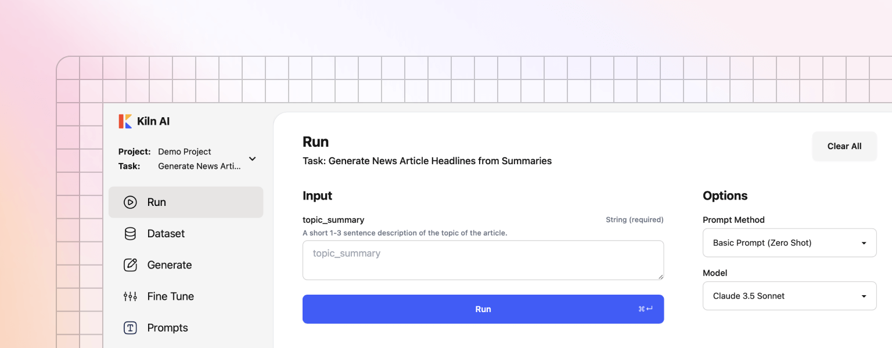

# Quickstart

<figure><figcaption></figcaption></figure>

* :desktop: **macOS, Windows and Linux**: run our app anywhere.
* 🧑‍💻 **Intuitive UI**: Our UI is designed for anyone, from AI novices to experts.
* 🚀 **One Click Setup**: No docker, terminal or dependencies required.

### Step 1: Download and Install

MacOS and Windows: download the [latest release](https://github.com/Kiln-AI/Kiln/releases/latest). Be sure to download the correct version (Windows, Mac for Apple Silicon, Mac for Intel).

[](https://github.com/Kiln-AI/Kiln/releases/latest)

Next, install the app:

* macOS: open the .dmg file, and drag the app to your Applications directory
* Windows: double click the installer, and follow the guide to install
* Linux: we suggest the installation command below.

<details>

<summary>Linux Installation Command</summary>

Run the following command in terminal to install Kiln:


```bash
curl -fsSL https://raw.githubusercontent.com/Kiln-AI/Kiln/refs/heads/main/app/desktop/linux_installer.sh | bash
```


You can download and review the install script before running. It will download the latest release from Github releases, install it to your path, and create an entry in your app launcher with a Kiln icon.

</details>

<details>

<summary>Windows Installer Troubleshooting</summary>

If you have any issues installing on Windows, check the solutions below:

* "Unrecognized App" warning: this warning may appear after we ship a new app update. This is just a warning. To bypass it, click "More Info" and continue the install.
* Anti-virus blockers: every release is scanned for viruses using [VirusTotal](https://www.virustotal.com/gui/home/upload), a comprehensive scanner that scans the app with over 70 virus scanners. Occasionally McAfee/AVG/Avast has a false positive (detects a virus when there isn't one). Feel free to scan the installer yourself (using VirusTotal or similar tool); once you trust the installer, add it to your virus scanner's allow-list.

</details>

### Step 2: Launch the App & Try Sample Task

Launch the app and get started!

The app will guide you through creating a project, creating a task, and connecting to AI providers like Ollama and OpenAI.&#x20;

Try our sample task for a quick exploration, or define your own custom task for your project.

### Next: Video Guides and Docs

Our end to end demo walks you through all the major features of Kiln in a 20 minute video:

<p align="center"><a href="end-to-end-project-demo.md"></a></p>

Our documents explain each feature, and how to use it:

* [Evaluations](evaluations.md)
* [Synthetic Data Generation](synthetic-data-generation.md)
* [Fine Tuning Guide](fine-tuning-guide.md)
* [Collaboration](collaboration.md)
* [Reviewing and Rating](reviewing-and-rating.md)
* [Organizing Datasets](organizing-datasets.md)
* See all docs in the navigation bar

