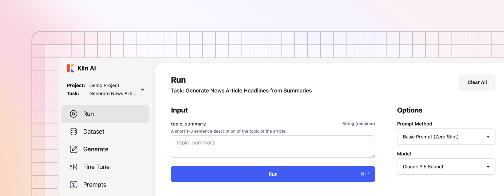

# Quickstart

<figure><figcaption></figcaption></figure>

* :desktop: **macOS, Windows and Linux**: run our app anywhere.
* 🧑‍💻 **Intuitive UI**: Our UI is designed for anyone, from AI novices to experts.
* 🚀 **One Click Setup**: No docker, terminal or dependencies required.

### Step 1: Download App

Download the [latest release](https://github.com/Kiln-AI/Kiln/releases/latest). Be sure to download the correct version (Windows, Linux, Mac for Apple Silicon, Mac for Intel).

### Step 2: Install the App

After downloading, install the app:

* macOS: open the .dmg file, and drag the app to your Applications directory
* Windows: double click the installer, and follow the guide to install
* Linux: save the app and launch it from terminal

Windows Installer Troubleshooting

If you have any issues installing on Windows, check the solutions below:

* "Unrecognized App" warning: this warning may appear after we ship a new app update. This is just a warning. To bypass it click "More Info" then continue the install.
* Anti-virus blockers: every release is scanned for viruses using [VirusTotal](https://www.virustotal.com/gui/home/upload), a comprehensive scanner that scans the app with over 70 virus scanners. Occasionally McAfee has a false positive (detects a virus when there isn't one). Feel free to scan the installer yourself (using VirusTotal or similar tool), and once you trust the installer, whitelist it in your virus scanner.

### Step 3: Launch the App

Launch the app and get started!

The app will guide you through creating a project, creating a task, and connecting to AI providers like Ollama, OpenAI, OpenRouter and more.

Try our sample task for a quick exploration, or define your own custom task for your project.

Check out some more of our guides to learn about the capabilities of Kiln:

* [Reviewing and Rating](../docs/reviewing-and-rating.md)
* [Synthetic Data Generation](../docs/synthetic-data-generation.md)
* [Fine Tuning Guide](../docs/fine-tuning-guide.md)
* [Collaboration](../docs/collaboration.md)
* [Organizing Datasets](../docs/organizing-datasets.md)
