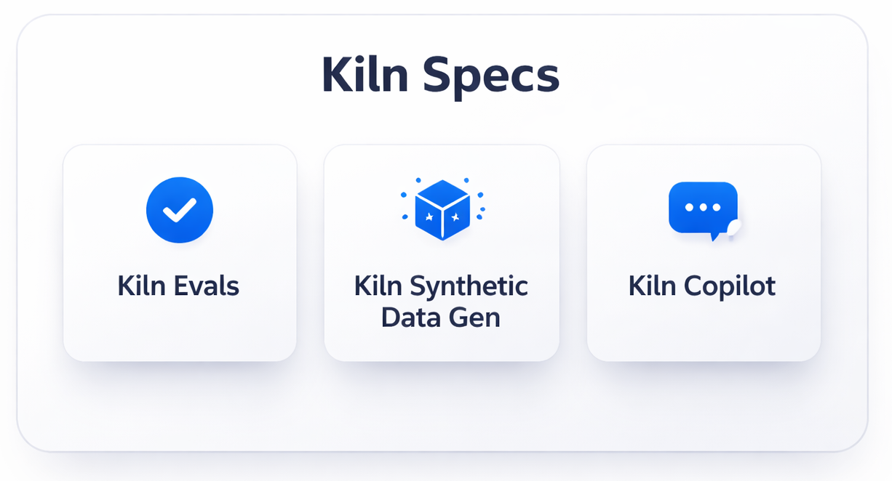

### Demo & Quick Start

<iframe src="https://player.vimeo.com/video/1161246105" style="position:absolute;top:0;left:0;width:100%;height:100%;border:0;border-radius:8px" allow="autoplay; fullscreen; picture-in-picture" allowfullscreen title="Video"></iframe>

:::note
**Note:** The Eval Builder requires a Kiln Pro account. Registration is free and easy inside the Kiln app.
:::

:::note
The Eval Builder currently only supports the creation of LLM as Judge evals.
:::

### What is the Kiln Eval Builder?&#x20;

<figure style="max-width:375px">

</figure>

The Kiln Eval Builder combines Kiln’s best features into one interactive tool: evals, synthetic data generation, automatic judge prompt creation, and edge case detection. Together they go beyond making an eval manually in several ways:

* **Identify Gaps with AI**: Kiln will read your judge prompt and help refine it. We detect underspecified aspects of your judge, conflicts with your task definition, ambiguous aspects that Judges may struggle with, and other common issues. It then works with you to close gaps and refine conflicts.
* **Interactive Human Alignment & Accuracy**: Building a LLM-as-Judge as good as a human isn’t easy. Human judges make subtle and subjective decisions, and have a hard time articulating their judgement process in a way LLMs can duplicate. Our alignment loop finds tough edge cases, compares LLM judge to human preference, and works with you iteratively until your judge is aligned to your preference.
* **Automatic Synthetic Data**: Build robust synthetic dataset generator as you work. By the time you save your eval you’ll have large and accurate datasets for evals and training.
* **Judge Meta-prompting**: Humans often struggle at writing effective eval judge prompts. Our judge meta-prompting takes your issues and concerns in human terms, and turns them into accurate and judge-able evals.
* **Easy to Use**: Subject matter experts can easily create accurate evals, without a lengthy iteration loop with data scientists. The Eval Builder will walk you through all the steps of defining your judge, creating synthetic data, golden dataset, aligning your judge, and creating training datasets. You get the same rigorous process, without managing each step.
* **Fast**: creating an eval can be done in as little as 5 minutes, compared to over 30 minutes manually.

### How to Get Started

Getting started is easy:

* Open the Kiln App to any task
* Click "Evals" in the sidebar
* Click "Create Eval"
* Connect Kiln Pro account (if you haven’t already)
* Follow the interactive steps until complete!

See the video above for a complete walkthrough.

