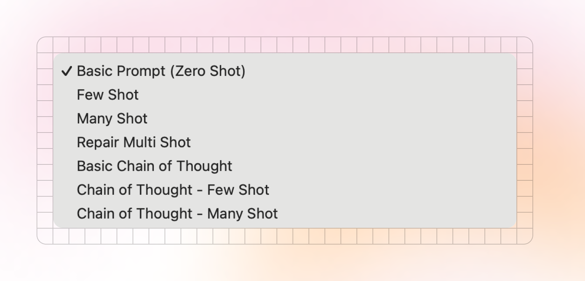
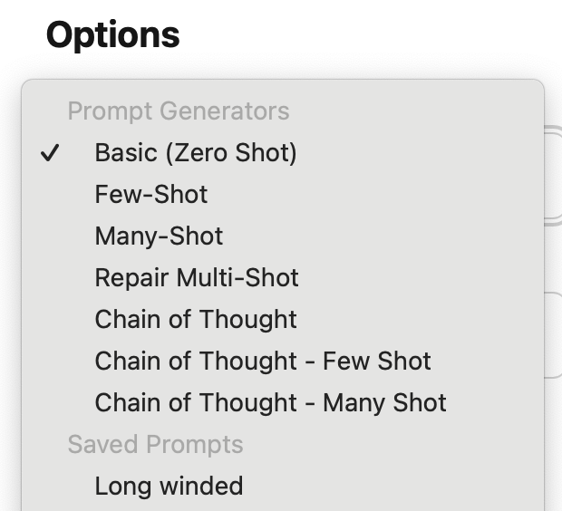

Kiln offers several methods to build and manage prompts

* [Automatic Prompt Generator](/docs/prompts/automatic-prompt-optimizer/): Our state-of-the-art automatic prompt optimizer. We run iterative experiments and use evals to pinpoint and fix failure modes — **no manual prompting required**.
* [Prompt Generators](/docs/prompts/#prompt-generators): Kiln can automatically generate many popular prompt styles from your task and dataset (few-shot, many-shot, chain of thought, chain of thought multi-shot, and more). The more you use your task, and rate the results, the richer your prompts become.
* [Custom Prompts](/docs/prompts/#custom-prompts): manually create, save and share any prompt.

<figure>

</figure>

## Viewing, Managing & Sharing Prompts

The "Prompts" tab in the UI lets you see and manage all of the prompts for the currently selected task.

* Create a new prompt
* View saved prompts
* Manage prompts (rename, delete)
* View prompt generators

Anyone you [collaborate](/docs/collaboration/) with will automatically have access to the same set of prompts.

## Prompt Fields

When creating a new prompt, there are several fields:

* Name: a name for you and your team to identify this prompt. Not used by the model.
* Prompt (aka System Message): The core of your prompt. Will be passed to the model as a system message before any user data is sent.
* Chain of thought instructions: if provided, using this prompt will add an extra "thinking"/reasoning phase to its execution. These instructions guide how the model should "think" about the problem before answering. See [docs on Chain of Thought and Thinking](/docs/reasoning-and-chain-of-thought/#chain-of-thought-call-flow-non-reasoning-model) for details.

## Using Prompts

You can select any available prompt or prompt generator from the prompt dropdown:

<figure style="max-width:310px">

<figcaption>
Select a Prompt
</figcaption>
</figure>

:::note
You can start typing to filter this list, which can make it easy to find a prompt by name.
:::

## When to Use Each Type of Prompt

Ultimately it's up to you when to use each style. The best approach varies from task to task, and model to model.&#x20;

It's worth evaluating a range of prompt/model pairs to find one that works best for your task, while considering speed/cost tradeoffs of longer prompts and larger models. [Kiln Evals](/docs/evals-and-specs/) give you a scientific way to find the best prompt for your task.

:::tip
**LLMs are often better at writing prompts than humans.** Given a good evaluator, they can test hundreds of unique prompts on thousands of test cased to find the ideal prompt.

**Try our** [**automatic prompt optimizer**](/docs/prompts/automatic-prompt-optimizer/) to find the best prompt for your task, using evals.&#x20;
:::

#### Don't Assume the Same Prompt Will Work on Every Model

Different models will interpret a prompt differently. You may need to re-optimize your prompt when changing or upgrading your model.

#### Prompts for Fine Tuning

If fine-tuning we generally suggest a tiered approach:

* For generating training data: use a long/powerful prompt like "Chain of Though - Few Shot", on a powerful model (GPT, Claude, Deepseek).&#x20;
* When building fine-tunes, try a range of included prompts, including the original prompt used when generating training data, the "Basic (Zero Shot)", and an even shorter custom fine-tune prompt. Also include a range of models and model sizes in your search (llama 1b, 3b, 8b, 70b, etc).
* Evaluate the resulting models. See if the longer prompts are necessary. It's possible the very short prompts will perform well after fine-tuning, which improves speed and lowers costs.
* Read more guidance from [OpenAI](https://platform.openai.com/docs/guides/fine-tuning#crafting-prompts)
